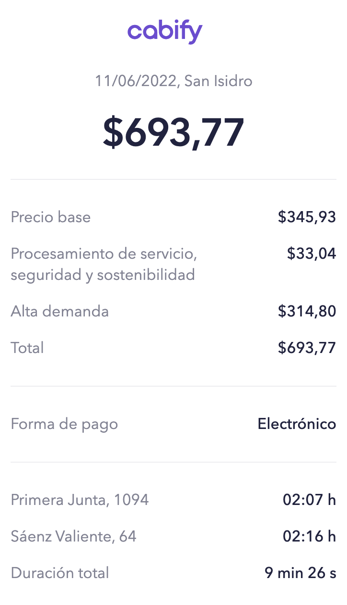
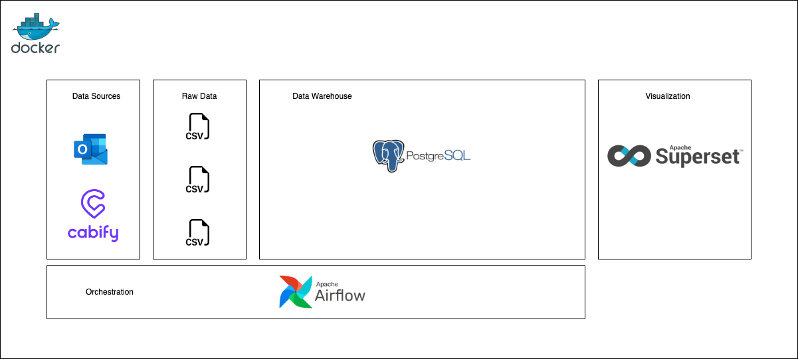
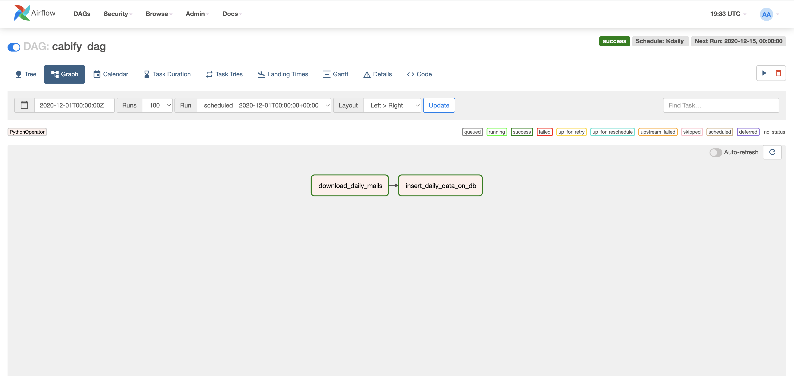
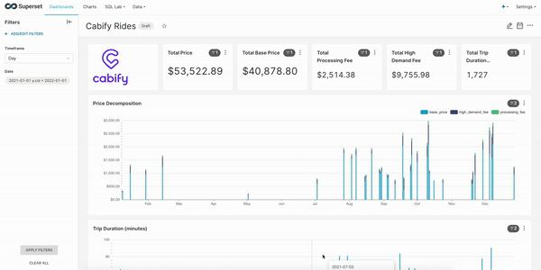

# Cabify Rides Tracker

[](https://airflow.apache.org/)
[](https://www.python.org/)
[](https://www.postgresql.org/)
[](https://superset.apache.org/)
[](https://www.docker.com/)

On the following project, I are going to retrieve the mails sent by Pedidos Ya after ordering food, and create my own dashboard to keep track the amount of money I spend on food, tips and shipping on Pedidos Ya app.

## Cabify
Cabify is a Spanish ridesharing company which provides vehicles for hire via its smartphone mobile app. Vehicles are driven by self-employed service providers. Operating in Spain, Portugal and Latin America,


Whenever you request a ride, you receive an email with the composition of the final price you aoid for it.



Here we can see an example of a Cabify email, where we can see the total cost, the base price, the high demand fee cost and the processing fee.

On this project, I am going to parse the mails, and store the data in a database, an the create a dashboard to track my spend on the app.

## Technologies Used
To accomplish this, I am going to use `Apache Airflow` to orchestrate the ETL. I am going to retrieve the daily mails from cabify, parse the data in a structured way so I can store it on a `PostgreSQL` database, and at the end, connect `Apache Superset` to the database to create a dashaboard to keep track of my spend.



### Docker
Docker is an open source containerization platform. It enables developers to package applications into containers—standardized executable components combining application source code with the operating system (OS) libraries and dependencies required to run that code in any environment.

Docker is essentially a toolkit that enables developers to build, deploy, run, update, and stop containers using simple commands and work-saving automation through a single API.

On the root directory of the project, you will find on the `docker-compose.yml` file, with the definition and configuration of all the services I am using to run the ETL. 

On that file also, I set the necessary environment variables, and there you should use your own variables referring to the email connection (on line 66):

```
# Email env variables
EMAIL_USERNAME: email_username
EMAIL_PASSWORD: email_password
IMAP_SERVER: outlook.office365.com
```

To start the services, I run the following commands:
```
$ echo -e "AIRFLOW_UID=$(id -u)\nAIRFLOW_GID=0" > .env
$ docker compose up airflow-init
$ docker compose up
```

This will spin up `Apache Airflow` on `localhost:8080`. We should use *Airflow* both as user and password.

### Apache Airflow
`Apache Airflow` is an open-source tool to programmatically author, schedule, and monitor workflows. It is one of the most robust platforms used by Data Engineers for orchestrating workflows or pipelines. You can easily visualize your data pipelines’ dependencies, progress, logs, code, trigger tasks, and success status.

With `Apache Airflow`, users can author workflows as Directed Acyclic Graphs (DAGs) of tasks. `Apache Airflow`’s rich user interface makes it easy to visualize pipelines running in production, monitor progress, and troubleshoot issues when needed. It connects with multiple data sources and can send an alert via email or Slack when a task completes or fails. `Apache Airflow` is distributed, scalable, and flexible, making it well suited to handle the orchestration of complex business logic.

Once on `localhost:8080`, we will see the DAG that downloads the daily mails, processes the mail, and stores the data on a table called `cabify_rides`.



Here we can see the previous example parsed on the DAG, and how it is stored on the database (note that the trip duration is already transformed to seconds).


### PostgreSQL
`PostgreSQL` is a powerful, open source object-relational database system with over 30 years of active development that has earned it a strong reputation for reliability, feature robustness, and performance. It is used as the primary data store or data warehouse for many web, mobile, geospatial, and analytics applications.


### Apache Superset
`Apache Superset` is a modern, enterprise-ready business intelligence web application. It is fast, lightweight, intuitive, and loaded with options that make it easy for users of all skill sets to explore and visualize their data, from simple pie charts to highly detailed deck.gl geospatial charts.

`Apache Superset` is cloud-native and designed to be highly available. It was designed to scale out to large, distributed environments and works very well inside containers. While you can easily test drive `Apache Superset` on a modest setup or simply on your laptop, there’s virtually no limit around scaling out the platform.

`Apache Superset` provides:
- An intuitive interface for visualizing datasets and crafting interactive dashboards
- A wide array of beautiful visualizations to showcase your data
- Code-free visualization builder to extract and present datasets
- A world-class SQL IDE for preparing data for visualization, including a rich metadata browser
- A lightweight semantic layer which empowers data analysts to quickly define custom dimensions and metrics
- Out-of-the-box support for most SQL-speaking databases
- Seamless, in-memory asynchronous caching and queries
- An extensible security model that allows configuration of very intricate rules on on who can access which product features and datasets.
- Integration with major authentication backends (database, OpenID, LDAP, OAuth, REMOTE_USER, etc)
- The ability to add custom visualization plugins
- An API for programmatic customization
- A cloud-native architecture designed from the ground up for scale

Once we have the database backfilled with all the mails parsed data, we can spin up `Apache Superset` and create a dahsboard to keep track of all the Pedidos Ya orders and spend.

To build `Apache Superset`, I am going to use the official `docker-compose-non-dev.yml`, which you can find on tghe `superset` directory

```
$ cd superset
$ docker-compose -f docker-compose-non-dev.yml up
```
This will spin up `Apache Superset` on `localhost:8088`. We should access using *admin* both as user and password.

Once we connect `Apache Superset` to the `PostgreSQL` database, I create the following dashboard.

